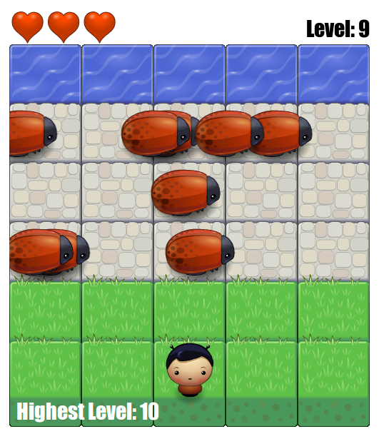

frontend-nanodegree-arcade-game
===============================

This is a simple arcade game written in JavaScript. It is one of the projects in
Udacity's Frontend Nanodegree program.

Details of the project can be found in this [guide][1].

The basic game engine and graphics were supplied by Udacity. Game logic and
features such as lives and high score were developed by me.

This repository was cloned from this Udacity [repository][2].
So you can see exactly what was my starting point.

## Required Libraries and Dependencies
You will need a modern web browser that supports HTML5 to play this game.
You also need a keyboard (the arrow keys allow you to move the player around
the screen).

## Project contents
This project consists for the following files:

* index.html - load this file in a web browser to play the game
* js/app.js - main JS file that defines the enemy and player classes
* js/engine.js - contains the main game loop and manages game rendering
* js/resources.js - handles the loading and caching of graphics
* images/ - directory containing game graphics
* css/style.css - style sheet for the web page holding the game

## How to Run the Project
Load the `index.html` in a modern web browser that supports HTML5.

## Extra features
In going beyond the [instructions][1] I added the following features:

* multiple levels, with each level containing one extra enemy
* a number of lives for the player before starting the game again at level 1
* high score that is saved in the users browser using localStorage

[1]: https://docs.google.com/document/d/1v01aScPjSWCCWQLIpFqvg3-vXLH2e8_SZQKC8jNO0Dc/pub?embedded=true
[2]: https://github.com/udacity/frontend-nanodegree-arcade-game
